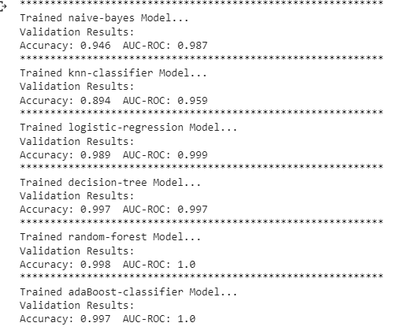
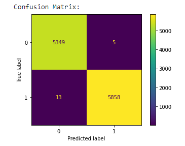
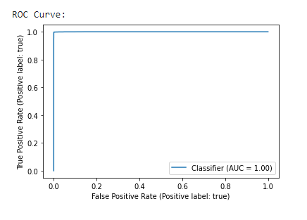

# FAKE NEWS DETECTION

## Abstract

In this project, I looked at how Natural Language Processing techniques can be used to detect when a news source is spreading fake news. To develop a classifier that can make judgements about information based on the content in the corpus, I used a corpus of labelled actual and false new articles. I have applied a text classification approach and examined the outcomes using four distinct classification models. All of the models developed for this study performed similarly. The logistic regression model has outperformed all others. Based on many articles originating from a source, the algorithm focuses on identifying fake news sources. We can anticipate with high confidence that any future publications from a source classified as a producer of fake news will also be fake news. Focusing on sources increases our article misclassification tolerance because each source now has several data points.

## Introduction

Fake news, which is defined as a false tale created with the purpose to deceive, has been heavily blamed for the outcome of the 2016 US presidential election. While Facebook's CEO, Mark Zuckerberg, issued a public statement [1] denying that the company had any influence on the election's outcome, Facebook and other online media outlets have begun to create tactics for detecting false news and preventing its spread. "This is an area where I feel we must move very carefully," Zuckerberg wrote, admitting that identifying false news is challenging. It is difficult to determine the truth. Fake news is becoming a growing threat to our society. It is usually produced for business purposes in order to attract viewers and create advertising income. People and groups with potentially harmful goals have been known to spread fake news around the world in order to influence events and policy. It's also believed that the spread of fake news influenced the outcome of the 2016 US Presidential Election [2].

## Data

This project's datasets were sourced from Kaggle [3]. The training dataset contains 20800 rows and 5 columns of data from various internet articles. In order to train our models, we had to undertake a lot of data pre-processing, as evidenced by the source code.
The following are the characteristics of a complete training dataset:
1.	title: a news article's headline
2.	Text: the article's text; in some situations, it is incomplete.
3.	Subject: what type of news
4.	Target: a marker that indicates that the article is potentially untrustworthy
5.	fake: Unreliable
6.	True: reliable

## Pre-processing Data

Social media data is highly unstructured majority of them are informal communication with typos, slangs and bad-grammar etc. [4]. Quest for increased performance and reliability has made it imperative to develop techniques for utilization of resources to make informed decisions [5]. To achieve better insights, it is necessary to clean the data before it can be used for predictive modelling. For this purpose, basic pre- processing was done on the News training data.

## Data Cleaning
To emphasize attributes that we want our machine learning system to pick up on, we need to clean up the text input. Cleaning (or pre-processing) the data usually involves many steps:
Removal of Punctuations: Punctuation can help us understand a sentence by providing grammatical context. However, because our vectorizer only counts the number of words and not the context, we eliminate all special characters.
Stopwords Removal: Stopwords are common words that can be found in almost any language. We eliminate them because they don't provide us with much information about our data.
Tokenizing: Tokenization is the process of dividing text into a list of tokens from a string of text. Tokens can be thought of as components, such as a word in a sentence or a sentence in a paragraph.

## Sentiment Analysis 

Sentiment is the expression of positive or negative in text. Sentiment analysis is a useful tool for analyzing spoken or written language to discover to what degree an expression is positive, negative, or neutral. I have used sentiment analysis to determine whether articles are reacting positively or negatively. If the distribution of true and fake articles differs significantly, these sentiments can be used as features.
Most articles in this dataset have polarity scores of around zero due to their length                                                                                                                                                                                         , indicating that they are neutral.

## Vectorizing Data

The presence of words in text data is described by the Bag of Words (BoW) or CountVectorizer. It returns 1 if the word is present in the phrase and 0 if it is not. As a result, each text document generates a bag of words with a document-matrix count.

## Algorithms

To evaluate the efficacy of fake news detection classifiers, I examined into multiple machine-learning algorithms. Kneighbors Classifier, Multinomial Naive Bayes, Decision Tree Classifier, Random Forest Classifier and AdaBoost Classifier.
The Python module Sci-Kit Learn was used to implement these classifiers.

### KNeighbors Classifier: -

KNN is an unsupervised machine learning model that can predict a certain data's outcome without the use of a dependent variable. We give the model sufficient training data and allow it to determine which specific neighborhood a data point belongs to. A new data point is assigned to a class that has the closest distance to its nearest neighbors if the value of K is 1, as the KNN model assesses the distance of a new data point to its nearest neighbors and the value of K estimates the majority of its neighbors' votes.
### Random Forest Classifier:- 

Random forest (RF) is a supervised learning model that is an enhanced version of decision trees (DT). RF is made up of a huge number of decision trees that work together to predict the outcome of a class, with the final prediction based on the class that obtained the most votes. Due to minimal correlation among trees, the error rate in random forest is low compared to other models [9]. Our random forest model was trained with various parameters, such as varying numbers of estimators, in a grid search to find the optimal model that can accurately predict the outcome. There are several strategies for deciding where to split a decision tree depending on a regression or classification problem.

### Multinomial Naïve Bayes:
This classification method is based on the Bayes theorem, which states that the existence of one feature in a class does not imply the inclusion of any other feature. It makes it possible to calculate the posterior probability.
  
### Decision Tree Classifier: -
The Decision-Tree algorithm is a popular supervised machine learning algorithm that can be used for both classification and regression tasks. The Decision-Tree algorithm's intuition is very simple to understand. A tree-like structure exists, with each internal node representing a test on an attribute, each branch representing the test's outcome, and each leaf node representing a class label. Classification rules are represented by the paths from the root node to the leaf node.

## Results:

Below mentioned are the results of all the trained models. In terms of machine learning model performance, Random Forest Classifier performed the best among all trained models, with an accuracy of 99% and both true positive rate and false positive rate close to 1.0 .

 
Confusion Matrices for Static Systems following the application of various extracted feature (Bag-of-words) .The confusion matrix displaying the actual and predicted sets of the best performed model is shown below.

The ROC curve shows that, both True positive rate and False positive rate are close to 1.0 and Area Under Curve is equal to 1.0, representing that model is peforming good at classifying the true and false news.

 

## Conclusion:

In order to resolve the problem of fake news, I have created the Fake News Detection system, which accepts user input and classifies it as genuine or false. Various NLP and Machine Learning techniques must be employed to accomplish this. The model is trained on a suitable dataset, and its performance is assessed using a variety of performance metrics. To classify news headlines or articles, the best model, i.e. the model with the highest accuracy, is utilized. Our best model as seen above was Random Forest Regression, which had an accuracy of 99% 

## References:-
[1] Zuckerberg, M., Facebook Post, https://www.facebook.com/zuck/posts/ 10103253901916271, November, 2016.

[2] Allcott, H., and Gentzkow, M., Social Media and Fake News in the 2016 Election, https://web. stanford.edu/œgentzkow/research/fakenews.pdf, January, 2017.

[3] https://www.kaggle.com/competitions/fake-news/data

[4] Aayush Ranjan, Fake News Detection Using Machine Learning, Department Of Computer Science & Engineering Delhi Technological University, July 2018

[5] Patil S.M., Malik A.K. (2019) Correlation Based Real-Time Data Analysis of Graduate Students Behaviour. In: Santosh K., Hegadi R. (eds) Recent Trends in Image Processing and Pattern Recognition. RTIP2R 2018. Communications in Computer and Information Science, vol 1037. Springer, Singapore.

[6] Shailesh-Dhama,Detecting-Fake-News-with-Python, Github, 2019

[7] Aayush Ranjan, Fake News Detection Using Machine Learning, Department Of Computer Science & Engineering Delhi Technological University, July 2018.

[8] T. M. Mitchell, The Discipline of Machine Learning, Carnegie Mellon University, Pittsburgh, PA, USA, 2006

[9] B. Gregorutti, B. Michel, and P. Saint-Pierre, “Correlation and variable importance in random forests,” Statistics and Computing, vol. 27, no. 3, pp. 659–678, 2017

